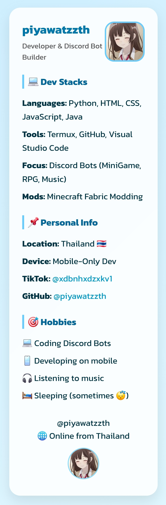

# 💻 DevProfileCard

A stylish, minimal, and responsive **developer profile card**  
Built with 💙 using **HTML + CSS** — perfect for personal landing pages!

---

## 🌟 Project Highlights

- 🎨 Clean & aesthetic blue theme
- 🧑‍💻 Font: Kanit (Thai math-style feel)
- 💡 Fully responsive & mobile-friendly
- 🧩 Sections:
  - Avatar & Name
  - Developer Info
  - Skills / Tools / Interests
  - Links to socials (TikTok, GitHub)
  - Country tag 🇹🇭

---

## 👤 About Me

- 🔧 **Name**: piyawatzzth  
- 📱 **Mostly codes on**: Android (Termux)
- 🇹🇭 **From**: Thailand
- 🎮 **Interests**: Discord Bots (MiniGame, Gacha, Music), Minecraft Modding
- 📹 **TikTok**: [@xdbnhxdzxkv1](https://www.tiktok.com/@xdbnhxdzxkv1)
- 💻 **GitHub**: [@piyawatzzth](https://github.com/piyawatzzth)

---
